

      <h1>  Car Rental System</h1>

    
    
    

# Tech Used

A modern web-based car rental system built with vanilla JavaScript, featuring car management, rental tracking, and user management.

## 🔴 Live Demo

Check out the live: [Car Rental System Demo](https://jamalihassan0307.github.io/Car-Rental-System-zh)

### Demo Credentials

- **Username:** demo
- **Password:** 1234

## 📸 Screenshots

### User Journey

#### 1. Login Page

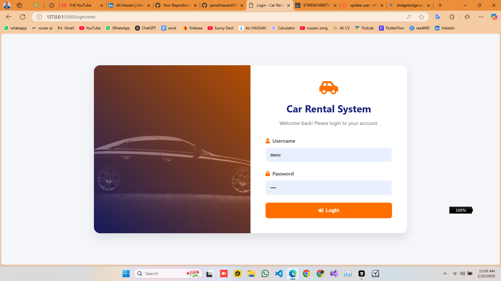
_Secure authentication interface_

#### 2. Dashboard Overview

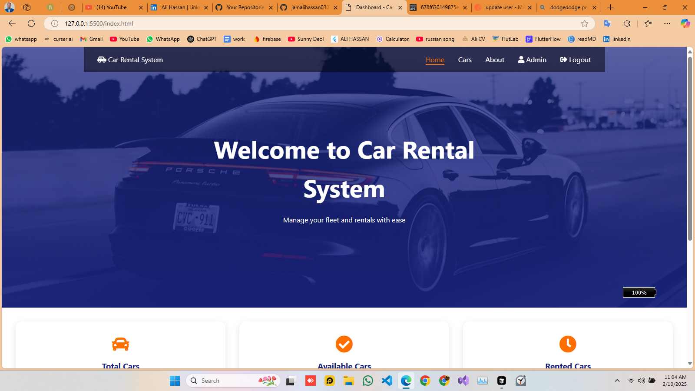
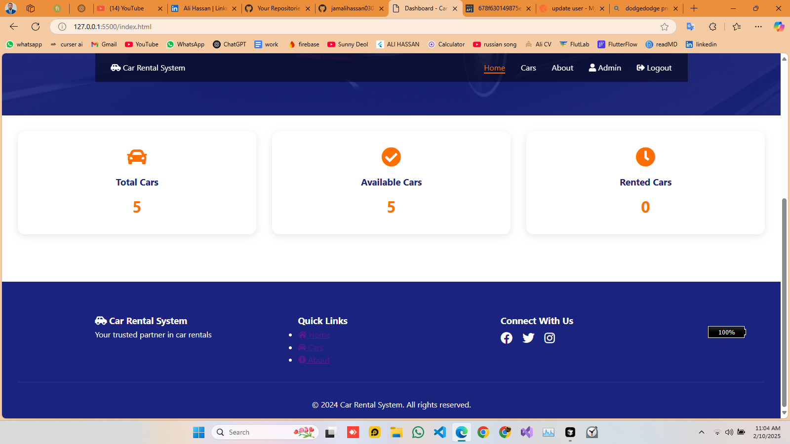
_Main dashboard with rental statistics_

#### 3. About Page

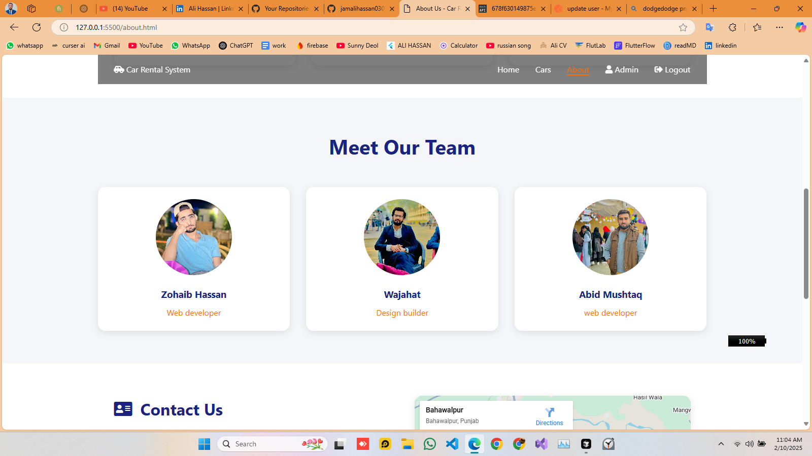
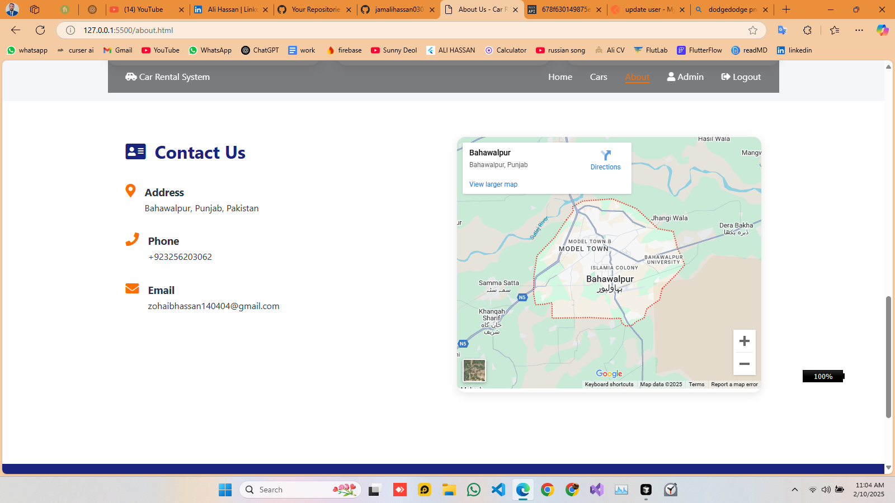
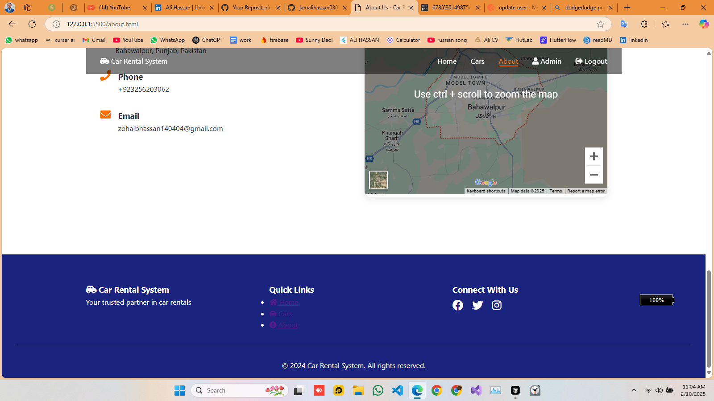
_About section with team and services information_

#### 4. Car Management

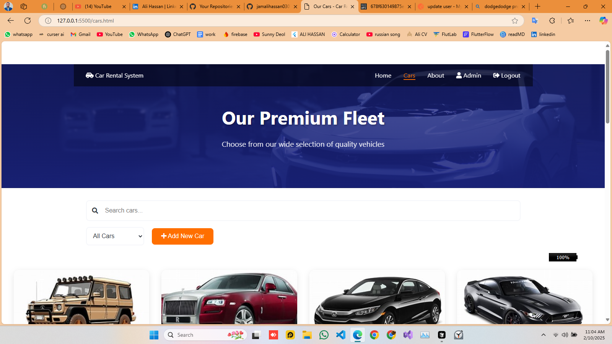
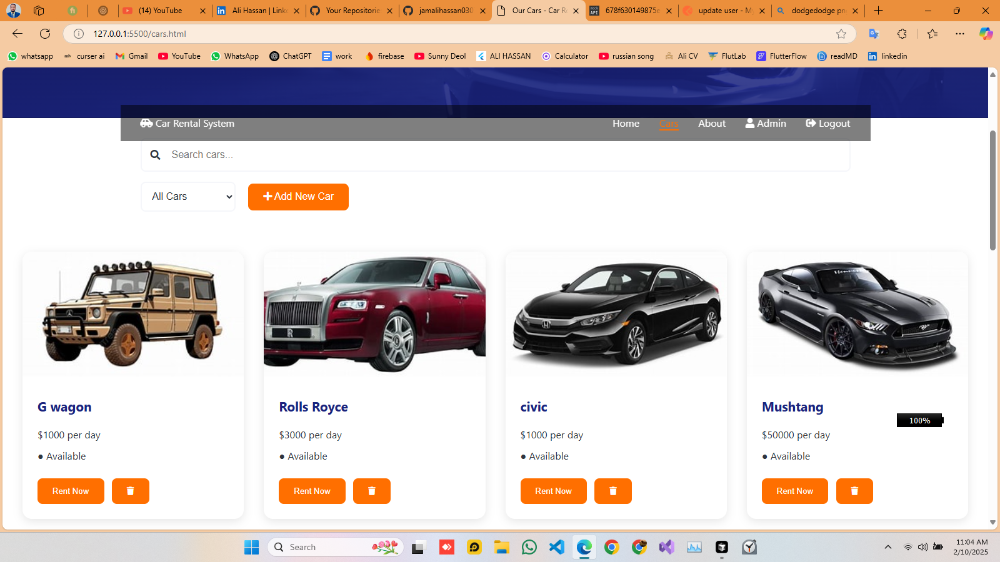
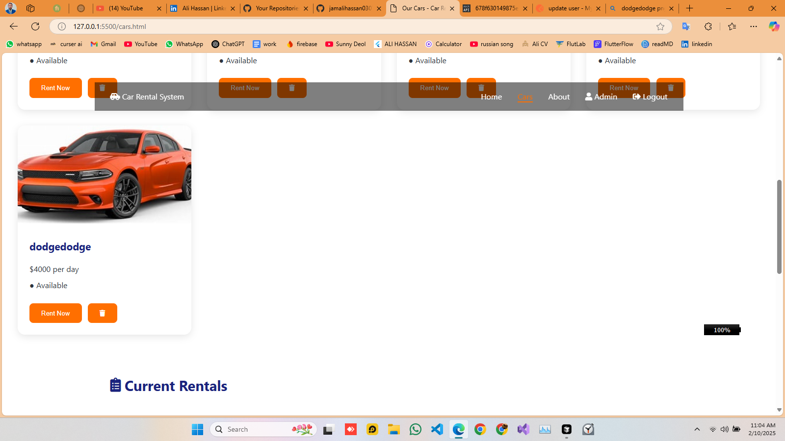
_Car inventory and management interface_

#### 5. Add New Car

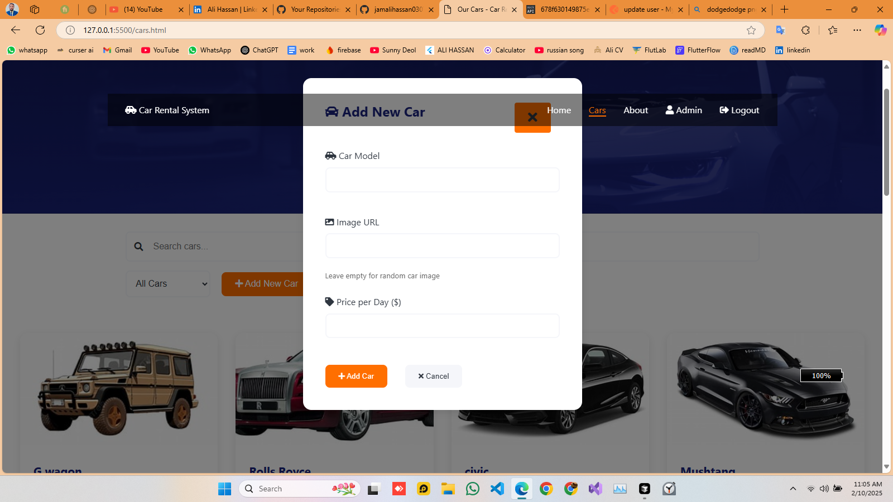
_Interface for adding new vehicles_

#### 6. Rental Details

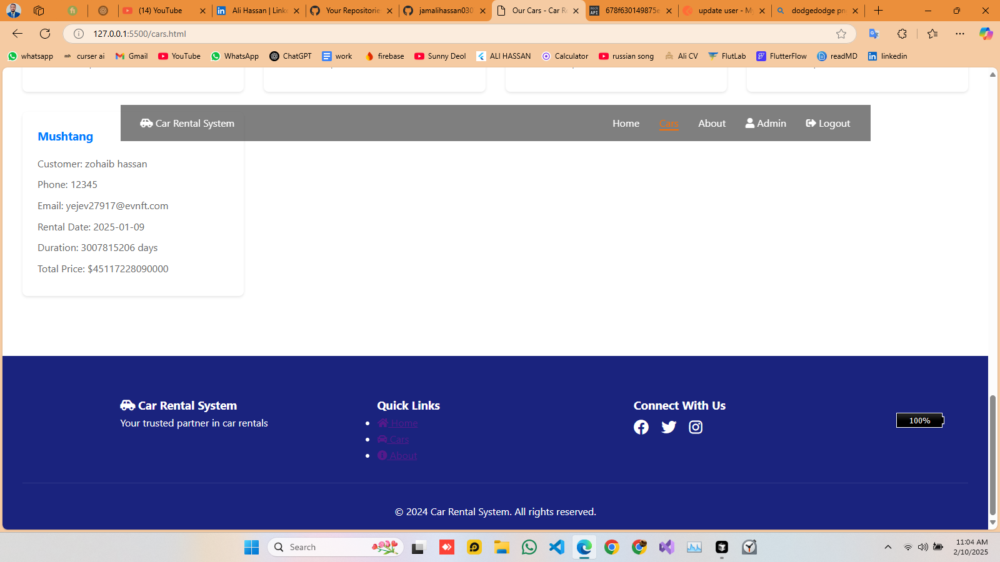
_Detailed rental information_

#### 7. User Management

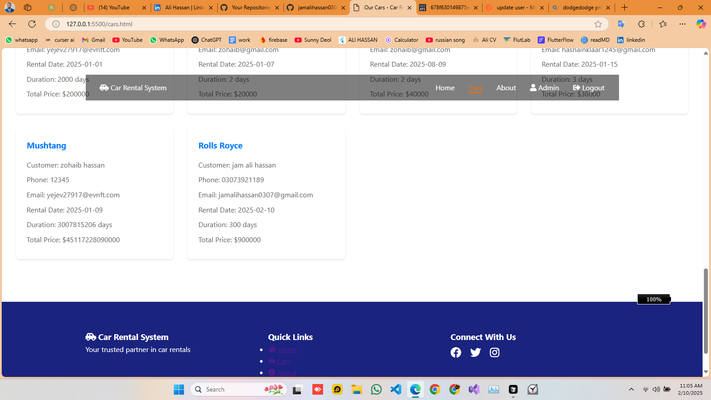
_Add new users to the system_

#### 8. Rental Process

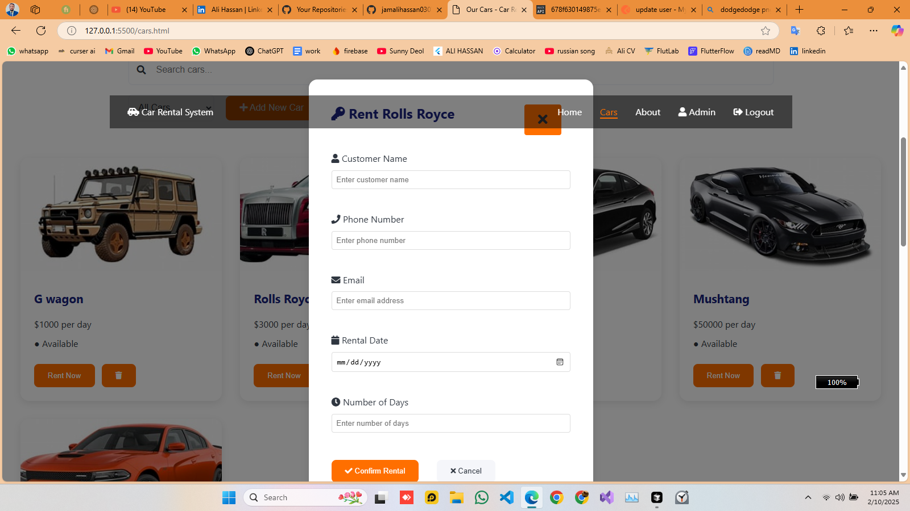
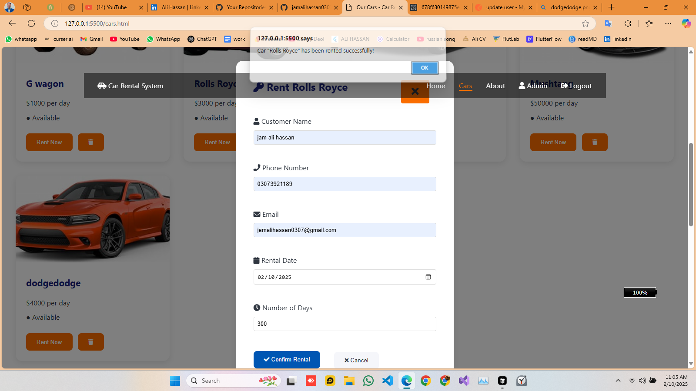
_Complete rental process workflow_

## 🚀 Features

- **User Authentication**

  - Secure login system
  - Protected routes
  - Session management

- **Car Management**

  - Add new cars
  - Edit existing cars
  - Update availability
  - Search cars

- **Rental Management**

  - Create new rentals
  - Track rental status
  - View rental history
  - Process returns

- **User Management**

  - Add new users
  - Track user rentals
  - Manage user profiles

- **Dashboard**
  - Total cars overview
  - Active rentals
  - Available cars
  - Recent activities

## 🛠️ Built With

- **Frontend**

  - HTML5
  - CSS3
  - Vanilla JavaScript

- **Storage**

  - LocalStorage for data persistence

- **Additional Features**
  - Responsive Design
  - Search Functionality
  - Real-time Updates

## 🙏 Acknowledgments

- [HTML5](https://developer.mozilla.org/en-US/docs/Web/HTML)
- [CSS3](https://developer.mozilla.org/en-US/docs/Web/CSS)
- [JavaScript](https://developer.mozilla.org/en-US/docs/Web/JavaScript)
