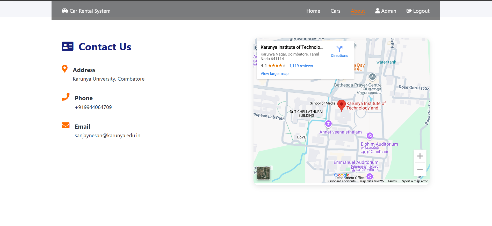
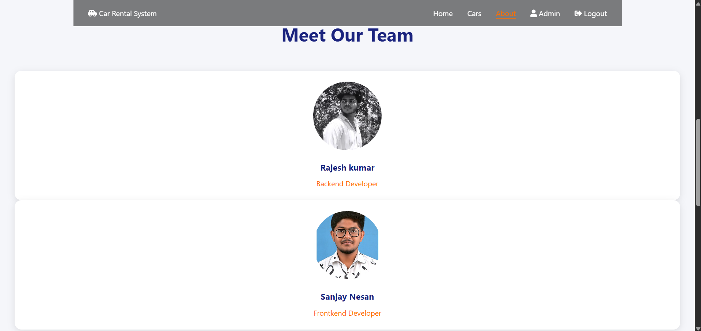

<<<<<<< HEAD

      <h1>  Car Rental System</h1>

# Tech Used

A modern web-based car rental system built with vanilla JavaScript, featuring car management, rental tracking, and user management.

## 📸 Screenshots

### User Journey

#### 1. Login Page

_Secure authentication interface_

#### 2. Dashboard Overview

_Main dashboard with rental statistics_

#### 3. About Page

_About section with team and services information_

#### 4. Car Management

_Car inventory and management interface_

#### 5. Add New Car

_Interface for adding new vehicles_

#### 6. Rental Details

_Detailed rental information_

#### 7. User Management

_Add new users to the system_

#### 8. Rental Process

_Complete rental process workflow_

## 🚀 Features

- **User Authentication**

  - Secure login system
  - Protected routes
  - Session management

- **Car Management**

  - Add new cars
  - Edit existing cars
  - Update availability
  - Search cars

- **Rental Management**

  - Create new rentals
  - Track rental status
  - View rental history
  - Process returns

- **User Management**

  - Add new users
  - Track user rentals
  - Manage user profiles

- **Dashboard**
  - Total cars overview
  - Active rentals
  - Available cars
  - Recent activities

## 🛠️ Built With

- **Frontend**

  - HTML5
  - CSS3
  - Vanilla JavaScript

- **Storage**

  - LocalStorage for data persistence

- **Additional Features**
  - Responsive Design
  - Search Functionality
  - Real-time Updates

## 🙏 Acknowledgments

- [HTML5](https://developer.mozilla.org/en-US/docs/Web/HTML)
- [CSS3](https://developer.mozilla.org/en-US/docs/Web/CSS)
- [JavaScript](https://developer.mozilla.org/en-US/docs/Web/JavaScript)
=======
# car-rental-system
>>>>>>> e20564de91f20d432f1597c3a0402d5a900ddbf1
